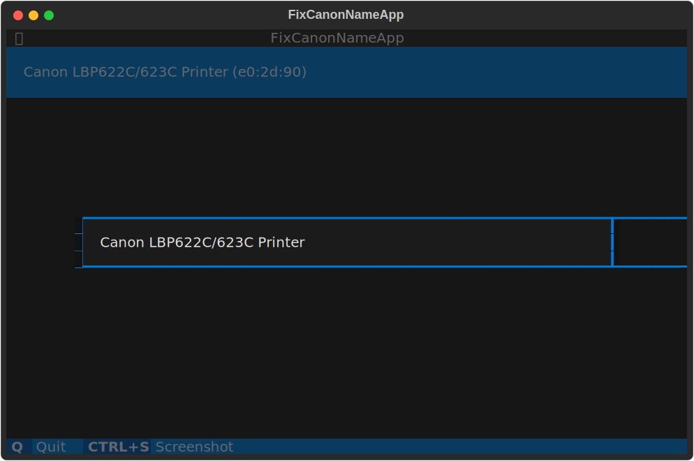
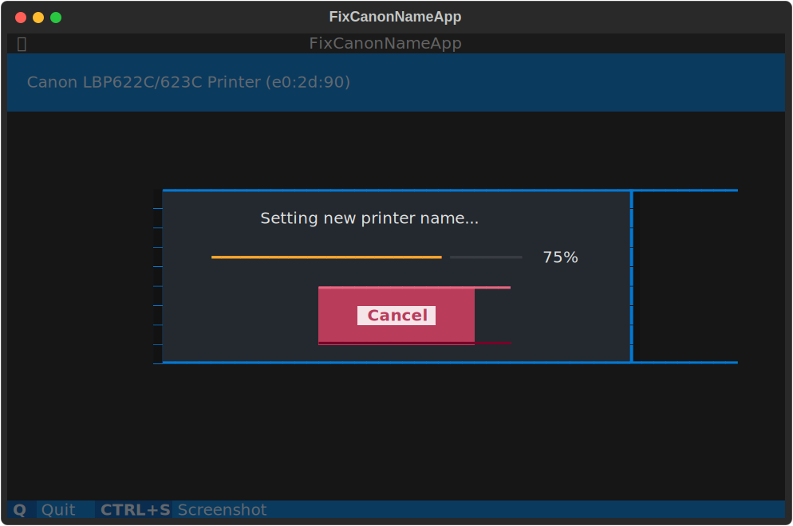

# Fix Canon Printer Name

Lots of people are complaining in the [Canon forums](https://community.usa.canon.com/t5/Printer-Software-Networking/imageCLASS-MF644Cdw-Airprint-name-keeps-changing/td-p/298543) about their Canon Airprint-enabled printers changing their names. Instead of `Canon LBP622C/623C Printer` they may change their name to `Canon LBP622C/623C Printer (a0:1b:23)`. Even worse, the printer keeps adding that hex code and after some time may even start overwriting the tail end of the name.

The solution is either to:
1. Keep installing the new printer each time the name changes;
2. Change the name back to the original name using the hard-to-navigate and frustratingly slow web UI.

Now, there is a third option using a terminal UI (TUI). It is still slow, but at least you can grab a coffee.


## Usage

You can start the TUI using the following command:
```shell
fix-canon-name
```
This will bring up a list of Airprint printers. Select using the cursor keys and press enter, or use you mouse to click on your printer. This will show an input field for the new name. The app tries to be smart about it by removing the hex codes, so the field will contain the original name:



If your satisfied, press enter again, enter your printer's web UI pin code and wait while the app is navigating the web UI in the background and changing the Airprint name:




## Installation

Note that this app uses the Firefox browser to access the remote UI in the background. So, obviously, you'll need to have Firefox installed.


### Using pipx

Just run
```shell
pipx install git+https://github.com/davidfokkema/fix-canon-name
```

### Using pip

Preferably in a new virtual environment, run
```shell
pip install git+https://github.com/davidfokkema/fix-canon-name
```


### From source, using Poetry

Clone the repository, cd into the repository's main directory and run
```shell
poetry install
```
